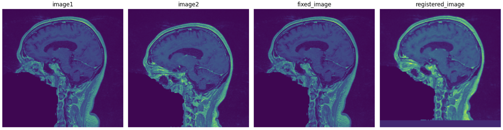
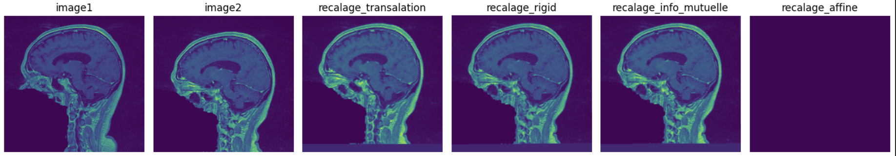
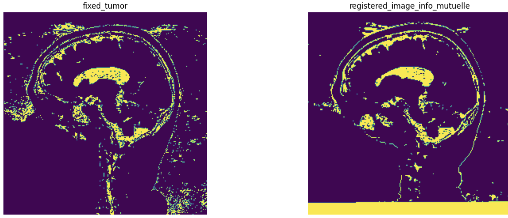
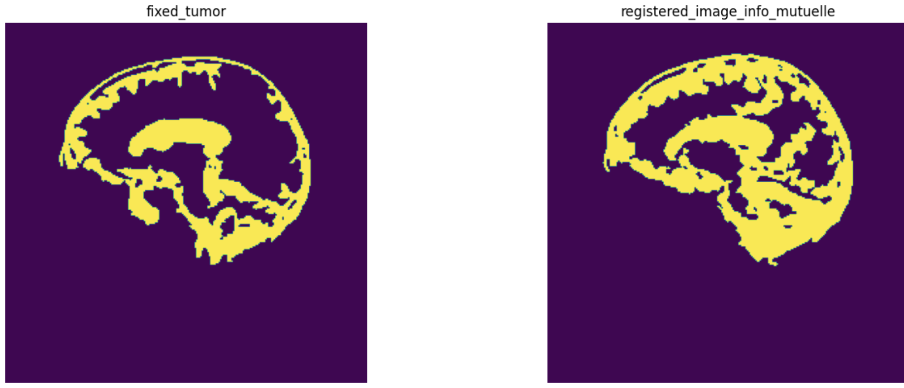
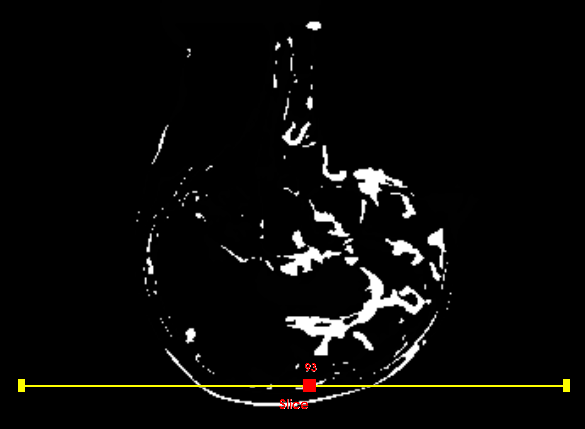
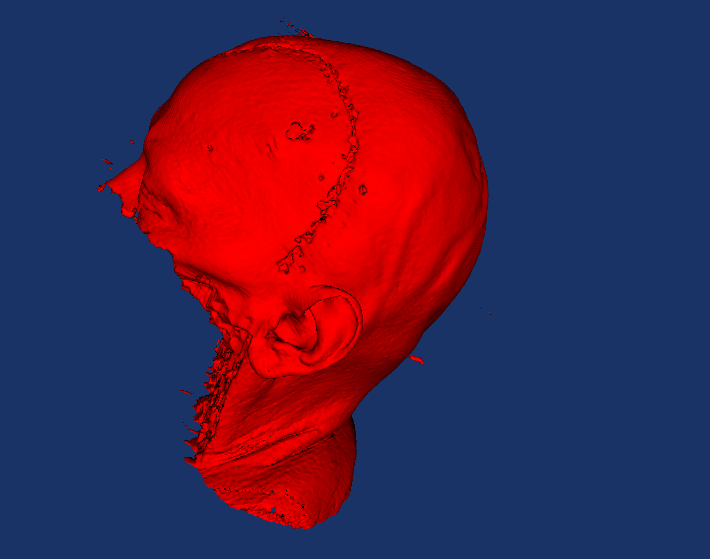

# Étude longitudinale de l’évolution d’une tumeur

L'objectif de ce projet est de réaliser le suivi des changements d'une tumeur à partir de deux scans effectués sur un même patient à des dates différentes, ce qu’on appelle également une “étude longitudinale”.

## Prérequis

- Python 3.7 ou plus récent
- Modules Python :
  - itk
  - vtk
  - numpy
  - matplotlib

## Notebook

Dans le dossier `notebook`, la phase exploratoire du projet est détaillée.

### Recalage d'images

Après la lecture des données, différentes méthodes de recalage ont été testées : 
- Recalage par translation  
  
- Recalage par transformation rigide
- Recalage par transformation affine
- Recalage par information mutuelle  
  

Nous avons opté pour le recalage par information mutuelle car il nous paraissait visuellement plus robuste.

### Segmentation des tumeurs

- Nous avons testé une méthode de segmentation en appliquant un seuil bas et haut (`BinaryThresholdImageFilter`),  
    
- Et une autre méthode (`ConnectedThresholdImageFilter`) que nous avons préférée car elle donnait de meilleurs résultats avec très peu de bruit.  
  

### Analyse et visualisation des changements

- Nous avons calculé les différences de volumes des données segmentées en comptant le nombre de voxels non nuls.
  (Example : Différence de volume: 341307 voxels)
- Ensuite, nous avons effectué la différence d’intensité des voxels, qui a ensuite été visualisée en tranches d'images 2D. On peut choisir quelle tranche 2D nous voulons voir et aussi avec la souris, on peut effectuer des rotations, des translations de l'image.  
  
- Nous avons également une visualisation 3D.  
  

## Problèmes rencontrés et solutions éventuelles

- **Recalage rigide d'images 3D** : Nous ne pouvions pas faire le recalage avec les fonctions proposées par ITK. La solution adoptée était d'obtenir des tranches 2D puis d'appliquer le recalage rigide vu en classe.
- **Segmentation en 3D** : La segmentation était également compliquée à faire en 3D. Nous avons donc opté pour la même technique que précédemment.
- **Choix de la visualisation** : La visualisation 3D n'apporte rien sauf sur le plan esthétique. Nous avons préféré les vues frontales avec le choix des slices. Cela permettrait au médecin de bien voir et de s'assurer du résultat obtenu par différence des deux segmentations.
- **Choix de seed pour la segmentation** : Ne sachant pas la position initiale de la tumeur, nous avons choisi le milieu de l'image pour faire fonctionner le pipeline.

## Utilisation
`python main.py --seed_x 200 --seed_y 200 --lower 10 --upper 200`

Arguments disponibles:
- --fixed_image_path: Chemin vers l’image fixe (par défaut : Data/case6_gre1.nrrd).
- --moving_image_path: Chemin vers l’image mobile (par défaut : Data/case6_gre2.nrrd).
- --registration_type: Type de recalage (options : info_mutuelle). Par défaut : info_mutuelle.
- --seed_x: Coordonnée x du point de départ pour la segmentation (par défaut : 150).
- --seed_y: Coordonnée y du point de départ pour la segmentation (par défaut : 150).
- --lower: Seuil inférieur pour la segmentation (par défaut : 0).
- --upper: Seuil supérieur pour la segmentation (par défaut : 255).

## Auteur

Abdoulaye Baldé